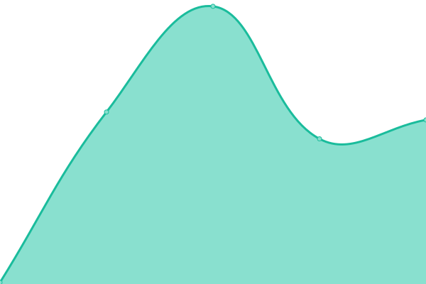

# Tough Talks Status

This repository contains the open-source uptime monitor and status page for [friedbeef1](https://status.toughtalks.ai), powered by [Upptime](https://github.com/upptime/upptime).

With [Upptime](https://upptime.js.org), you can get your own unlimited and free uptime monitor and status page, powered entirely by a GitHub repository. We use [Issues](https://github.com/friedbeef1/toughtalks-status/issues) as incident reports, [Actions](https://github.com/friedbeef1/toughtalks-status/actions) as uptime monitors, and [Pages](https://status.toughtalks.ai) for the status page.

<!--start: status pages-->
<!-- This summary is generated by Upptime (https://github.com/upptime/upptime) -->
<!-- Do not edit this manually, your changes will be overwritten -->
<!-- prettier-ignore -->
| URL | Status | History | Response Time | Uptime |
| --- | ------ | ------- | ------------- | ------ |
|  [Tough Talks Web](https://toughtalks.ai) | 🟩 Up | [tough-talks-web.yml](https://github.com/friedbeef1/toughtalks-status/commits/HEAD/history/tough-talks-web.yml) | 

 154ms
     
 | 

<a href="https://status.toughtalks.ai/history/tough-talks-web">100.00%</a>
    

|  [Tough Talks Audio Proxy](https://toughtalks-audio.fly.dev/health) | 🟩 Up | [tough-talks-audio-proxy.yml](https://github.com/friedbeef1/toughtalks-status/commits/HEAD/history/tough-talks-audio-proxy.yml) | 

 665ms
     
 | 

<a href="https://status.toughtalks.ai/history/tough-talks-audio-proxy">100.00%</a>
    

<!--end: status pages-->

[**Visit our status website →**](https://status.toughtalks.ai)

## 📄 License

- Powered by: [Upptime](https://github.com/upptime/upptime)
- Code: [MIT](./LICENSE) © [Anand Chowdhary](https://anandchowdhary.com), supported by [Pabio](https://pabio.com)
- Data in the `./history` directory: [Open Database License](https://opendatacommons.org/licenses/odbl/1-0/)
